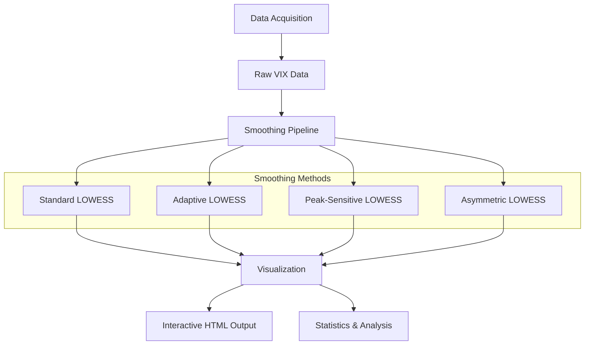

# VIX Smoothing Analysis

This repository implements a sophisticated pipeline for smoothing and analyzing the VIX (Volatility Index) data using various LOWESS techniques. It downloads historical VIX data from the FRED API and applies multiple smoothing methods to compare their performance in preserving important features such as peaks.

## Overview

The main objectives of the project are:
- **Data Acquisition:** Download and preprocess VIX data.
- **Smoothing Techniques:** Apply different LOWESS algorithms:
  - **Standard LOWESS:** With variable spans.
  - **Adaptive LOWESS:** Adjusts bandwidth using local volatility and gradient information.
  - **Peak-Sensitive LOWESS:** Preserves peaks by detecting and adapting to significant signal changes.
  - **Asymmetric LOWESS:** Emphasizes upward movements in data.
- **Visualization:** Generate an interactive Plotly visualization comparing smoothing methods, complete with filtering options and interactive elements.
- **Performance Analysis:** Print summary statistics and peak preservation analysis for a detailed comparison.

## Features

- **Interactive Visualization:** Generates an HTML file (`vix_smoothing_analysis.html`) with a responsive Plotly chart including range sliders and update buttons to control curve visibility.
- **Multiple Smoothing Methods:** Compares standard, adaptive, peak-sensitive, and asymmetric LOWESS techniques.
- **Statistical Analysis:** Outputs summary statistics and metrics on peak preservation.

## Installation

1. **Clone the repository:**
   ```
   git clone <repository-url>
   cd smoothing
   ```

2. **Install Dependencies:**
   Make sure you have Python installed. Install the required libraries:
   ```
   pip install pandas numpy plotly pandas_datareader statsmodels scikit-learn scipy
   ```

3. **Data Source:**
   The code uses the FRED API to fetch VIX data (ticker: `VIXCLS`). Ensure your machine has access to the internet.

## Usage

Run the pipeline using the command below:
```
python smoothing.py
```
This will:
- Download and preprocess the VIX data.
- Compute various smoothed versions of the data.
- Generate an interactive HTML visualization (`vix_smoothing_analysis.html`).
- Print summary statistics and peak preservation analysis in the console.

## Project Structure



## Smoothing Techniques Explained

- **Standard LOWESS:** Applies a fixed bandwidth to smooth data and offers different spans (e.g., 0.1 and 0.3).
- **Adaptive LOWESS:** Dynamically adjusts the smoothing parameter based on local volatility and gradient of data.
- **Peak-Sensitive LOWESS:** Detects peaks using signal prominence and applies a higher weight to raw data around peaks.
- **Asymmetric LOWESS:** Provides a bias toward upward movements to retain significant sharp increases.

## Visual Output

The generated interactive HTML visualization allows users to:
- Zoom into the data
- Toggle visibility of different smoothing curves
- Examine the behavior of various smoothing methods side-by-side

## Dependencies

- Python 3.x
- [Pandas](https://pandas.pydata.org/)
- [NumPy](https://numpy.org/)
- [Plotly](https://plotly.com/python/)
- [pandas_datareader](https://pandas-datareader.readthedocs.io/)
- [statsmodels](https://www.statsmodels.org/)
- [scikit-learn](https://scikit-learn.org/)
- [SciPy](https://scipy.org/)

## Conclusion

This project provides a comprehensive analysis of various LOWESS smoothing techniques on VIX data. It is an excellent resource for studying the effects of different smoothing algorithms and observing how they handle peak preservation.

Happy analyzing!
